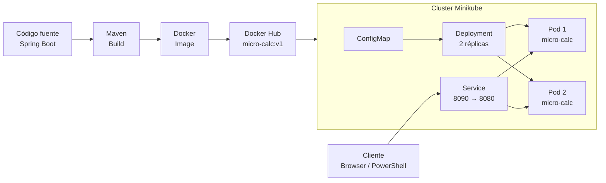

# Micro-Calc — Despliegue Cloud Native

## Descripción

Proyecto académico orientado a implementar el ciclo básico de construcción, contenerización, publicación y despliegue de un microservicio **Spring Boot** utilizando **Docker, Docker Hub, Kubernetes y Minikube**.

El proyecto permite demostrar el flujo completo desde el código fuente hasta la ejecución del microservicio dentro de un clúster Kubernetes local.

---

## Objetivo

Aplicar conceptos fundamentales de arquitectura Cloud Native mediante:

* Compilación de una aplicación Java 21 con Maven.
* Construcción de una imagen Docker.
* Ejecución local mediante contenedores.
* Publicación de la imagen en Docker Hub.
* Creación de manifiestos Kubernetes.
* Despliegue del microservicio en Minikube.
* Validación del servicio mediante HTTP.

---

## Tecnologías

| Tecnología  | Uso                         |
| ----------- | --------------------------- |
| Java 21     | Lenguaje de desarrollo      |
| Spring Boot | Framework del microservicio |
| Maven       | Compilación y empaquetado   |
| Docker      | Contenerización             |
| Docker Hub  | Registro de imágenes        |
| Kubernetes  | Orquestación                |
| Minikube    | Clúster Kubernetes local    |
| Git         | Control de versiones        |

---

## Arquitectura



### Flujo general

```text
Código fuente
     ↓
Maven Build
     ↓
Imagen Docker
     ↓
Docker Hub
     ↓
Deployment Kubernetes
     ↓
Pods
     ↓
Service
     ↓
Cliente HTTP
```

---

## Estructura del proyecto

```text
micro-calc/
├── src/
├── pom.xml
├── Dockerfile
└── k8s/
    ├── namespace.yaml
    ├── configmap.yaml
    ├── deployment.yaml
    ├── service.yaml
    └── hpa.yaml
```

---

## Compilación

```bash
mvn clean package -DskipTests
```

---

## Construcción de la imagen Docker

```bash
docker build -t USUARIO_DOCKERHUB/micro-calc:v1 .
```

Verificar la imagen:

```bash
docker images
```

---

## Ejecución local

```bash
docker run --name micro-calc-local -p 8080:8080 USUARIO_DOCKERHUB/micro-calc:v1
```

Prueba:

```bash
curl http://localhost:8080/suma/1/2
```

---

## Publicación en Docker Hub

Autenticación:

```bash
docker login
```

Publicación:

```bash
docker push USUARIO_DOCKERHUB/micro-calc:v1
```

---

## Inicio de Minikube

```bash
minikube start --driver=docker --cpus=2 --memory=4096
```

Verificar:

```bash
minikube status
kubectl get nodes
```

---

## Despliegue en Kubernetes

```bash
kubectl apply -f k8s/namespace.yaml
kubectl apply -f k8s/configmap.yaml
kubectl apply -f k8s/deployment.yaml
kubectl apply -f k8s/service.yaml
```

Para el HPA:

```bash
minikube addons enable metrics-server
kubectl apply -f k8s/hpa.yaml
```

---

## Validación

Verificar los recursos desplegados:

```bash
kubectl get all -n micro-calc
```

Ver los pods:

```bash
kubectl get pods -n micro-calc -o wide
```

Consultar logs:

```bash
kubectl logs -n micro-calc deployment/micro-calc
```

---

## Acceso al microservicio

```bash
minikube service micro-calc-service -n micro-calc
```

Endpoint de prueba:

```text
GET /suma/1/2
```

Ejemplo:

```bash
curl http://URL_GENERADA/suma/1/2
```

---

## Resultado

La solución implementa el siguiente ciclo Cloud Native:

**Spring Boot → Maven → Docker → Docker Hub → Kubernetes → Minikube**

El microservicio es desplegado mediante un `Deployment` con múltiples réplicas, utiliza un `ConfigMap` para configuración y es expuesto mediante un `Service` de Kubernetes.

---

## Conclusión

El proyecto demuestra de manera práctica el proceso de contenerización y orquestación de un microservicio, aplicando Docker para la generación y distribución de imágenes y Kubernetes con Minikube para administrar su despliegue y disponibilidad.
